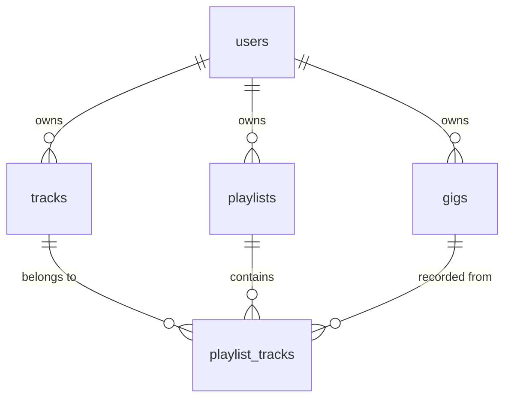

# Implementation Plan: DJ Setlist AI (AI Copilot for DJs)

DJ Setlist AI is an AI-powered assistant designed to help DJs build, manage, and optimize setlists using harmonic mixing principles (BPM, Camelot Key, Energy level) and context-aware LLMs.

---

## 1. Technical Stack & Architecture

### Frontend & Backend (Monolith)
* **Framework:** Next.js 15 (App Router, React 19, Server Actions, API Routes)
* **Styling:** Tailwind CSS + custom HSL color palette
* **UI Components:** `shadcn/ui` (built on Radix UI) + Framer Motion for smooth micro-animations and transitions
* **Icons:** Lucide React

### Database & Auth
* **Provider:** **Supabase** (PostgreSQL)
* **Auth:** Supabase Auth (Email/Password, OAuth providers like Google)
* **Database Extensions:** `pgvector` (optional, for vector embedding track similarity)
* **Row Level Security (RLS):** Strict policy isolation per user

### Storage
* **Provider:** Supabase Storage (Object storage bucket named `track-library` for audio uploads)

### AI & Processing Pipeline
1. **Metadata Extractor (Client/Server):** Browser-side ID3 parser (`music-metadata-browser`) to read track metadata immediately on upload.
2. **Audio Analyzer (Python Service or Edge Function):** Web Audio API for client-side analysis or a lightweight python service (Librosa/Essentia) to extract BPM, Camelot Key, Energy levels, and Mood.
3. **Recommendation Engine (PostgreSQL/Local):** Harmonic mixing algorithm using Camelot Key wheel compatibility rules and BPM difference calculations.
4. **LLM Copilot (Gemini / Hugging Face / OpenAI):** Generates structured setlists from prompt instructions ("Create a 2-hour set for a sunset beach party...").

---

## 2. Database Schema Design (PostgreSQL)



### Table Details

#### 1. `profiles`
Extends Supabase `auth.users` for DJ-specific profile metadata.
* `id` (UUID, PK, References auth.users.id)
* `updated_at` (Timestamp)
* `dj_name` (Text)
* `avatar_url` (Text)
* `preferences` (JSONB - e.g., default genres, favorite BPM ranges)

#### 2. `tracks`
Main library of audio tracks uploaded by the user.
* `id` (UUID, PK)
* `user_id` (UUID, FK -> profiles.id, Cascade Delete)
* `title` (Text)
* `artist` (Text)
* `album` (Text, Nullable)
* `genre` (Text, Nullable)
* `duration` (Numeric - in seconds)
* `bpm` (Numeric, Nullable)
* `key` (Text, Nullable - e.g., "8A", "5B", "Am")
* `energy` (Integer, Nullable - 1 to 10)
* `mood` (Text, Nullable)
* `file_path` (Text, Nullable - Storage URL/Path)
* `file_size` (BigInt, Nullable)
* `is_favorite` (Boolean, Default: false)
* `rating` (Integer, Default: 0 - 0 to 5)
* `play_count` (Integer, Default: 0)
* `created_at` (Timestamp)

#### 3. `playlists`
Setlists generated or custom-curated by the DJ.
* `id` (UUID, PK)
* `user_id` (UUID, FK -> profiles.id, Cascade Delete)
* `name` (Text)
* `description` (Text, Nullable)
* `event_type` (Text, Nullable - e.g., "Wedding", "Club")
* `target_duration` (Integer, Nullable - in minutes)
* `target_genre` (Text, Nullable)
* `target_mood` (Text, Nullable)
* `is_ai_generated` (Boolean, Default: false)
* `ai_prompt` (Text, Nullable)
* `created_at` (Timestamp)

#### 4. `playlist_tracks`
Junction table tracking ordered songs inside playlists.
* `id` (UUID, PK)
* `playlist_id` (UUID, FK -> playlists.id, Cascade Delete)
* `track_id` (UUID, FK -> tracks.id, Cascade Delete)
* `position` (Integer - order index)
* `transition_notes` (Text, Nullable - AI or DJ notes on how to transition into this track)
* `created_at` (Timestamp)

#### 5. `gigs`
Performance logs (gigs history).
* `id` (UUID, PK)
* `user_id` (UUID, FK -> profiles.id, Cascade Delete)
* `playlist_id` (UUID, FK -> playlists.id, Nullable, Set Null)
* `title` (Text - e.g., "Sunset Lounge Bali")
* `venue` (Text, Nullable)
* `date` (Date)
* `crowd_rating` (Integer, Default: 0)
* `notes` (Text, Nullable)
* `created_at` (Timestamp)

---

## 3. Directory Structure (Next.js 15 App Router)

```text
├── app/
│   ├── (auth)/
│   │   ├── login/page.tsx
│   │   ├── register/page.tsx
│   │   └── reset-password/page.tsx
│   ├── dashboard/
│   │   ├── page.tsx          # Statistics, Quick Actions, Recent Gigs
│   │   ├── library/page.tsx   # Music CRUD, upload drag-and-drop
│   │   ├── setlists/
│   │   │   ├── page.tsx      # All setlists
│   │   │   └── [id]/page.tsx  # Detailed setlist view + AI recommendation sidebar
│   │   ├── gigs/page.tsx      # History logs
│   │   └── settings/page.tsx  # Profile & integration config
│   ├── api/
│   │   ├── analyze/route.ts  # Trigger audio analysis
│   │   └── setlist/route.ts  # LLM endpoint for setlist generation
│   ├── layout.tsx
│   └── page.tsx              # Dynamic landing page (WOW aesthetics)
├── components/
│   ├── ui/                   # shadcn/ui components (button, card, dialog, etc.)
│   ├── dashboard/            # Specific dashboard features (Sidebar, StatCards)
│   ├── library/              # Music player, metadata editors, uploaders
│   └── setlist/              # Setlist builder, transition visualizer
├── lib/
│   ├── supabase/             # Client & Server supabase wrappers
│   ├── utils/                # Key converters, BPM helpers, Tailwind merging
│   └── ai/                   # AI logic (Hugging Face, Gemini integrations)
├── public/                   # Static assets
└── types/                    # DB & local TS interfaces
```

---

## 4. UI Design & Aesthetics

We will use a sleek, modern **Cyber-Club Dark Mode** as the primary styling theme:
* **Backgrounds:** Rich charcoal/obsidian tones (`#09090b` or HSL `240 10% 3.9%`) with glassmorphism overlays (acrylic card backdrops).
* **Accents:** Neon hues representing club lights:
  * Neon Violet/Indigo (Primary CTA: `#6366f1` / `#8b5cf6`)
  * Electric Emerald (Successful key matches, BPM alignment: `#10b981`)
  * Hot Pink/Magenta (Warnings, energy surge indicators: `#ec4899`)
* **Typography:** Modern Sans-Serif (e.g., *Outfit* or *Inter* font family) with clean headers and high contrast.
* **Micro-animations:** Hover card expansions, glowing borders for high energy tracks, smooth drag-and-drop ordering transitions, and waveform animations for active playback.

---

## 5. Development Roadmap

### Phase 1: Foundations & MVP (Weeks 1-2)
1. **Project Setup:** Initialize Next.js 15, Tailwind, and shadcn. Run local verification.
2. **Supabase & Authentication:** Connect project to Supabase, set up Auth UI, configure PostgreSQL schema tables and Storage Bucket for files.
3. **Music Library & Upload:** Build the track library UI. Implement file upload with drag-and-drop. Parse basic ID3 meta tags on upload (Title, Artist, Duration).
4. **Basic Setlist Generator:** Build a manual setlist editor where users can search their library and arrange songs. Include basic auto-matching suggestions based on BPM (within +/- 5 BPM) and exact key matches.

### Phase 2: Intelligent Recommendation & Audio Insights (Weeks 3-4)
1. **Camelot Wheel Mixing Engine:** Implement a visual Camelot Key wheel compatibility checker (e.g., standard harmonic mixing rules: +/-1A/B, same key, same number opposite letter).
2. **Advanced recommendations:** Implement a "Smart Recommend" sidebar that displays the top 5 compatible tracks to follow the currently selected song.
3. **Gig History & Dashboard Stats:** Build a dashboard showcasing DJ statistics (Average BPM, top genres, play counts) and logging past gigs.
4. **Mocked/API Audio Analysis:** Integrate an audio parser to estimate BPM/Key/Energy level when file metadata is missing.

### Phase 3: AI Copilot & LLM (Weeks 5-6)
1. **AI Setlist Copilot:** Integrate an LLM (Gemini or Hugging Face) using a system prompt that understands DJ technique. Create an input form (Event type, length, target crowd, starting genre) that generates an entire sequence.
2. **AI Transition Explanations:** Display notes on *why* the AI chose each transition (e.g., "Matches Energy tier, steps up BPM from 122 to 124, Camelot 8A to 9A").
3. **Export Engine:** Add PDF/CSV export and standard `.m3u` playlist export (compatible with Rekordbox/Serato).

### Phase 4: Live View & Refinements (Weeks 7+)
1. **Live Performance Deck:** Full-screen responsive dashboard designed for low-light DJ booths, highlighting the current track, elapsed time, and next 3 queued tracks.
2. **Real-time Crowd Response Log:** Simple buttons to log if a song "killed it", "maintained crowd", or "cleared floor" to adjust weights of future recommendations.
